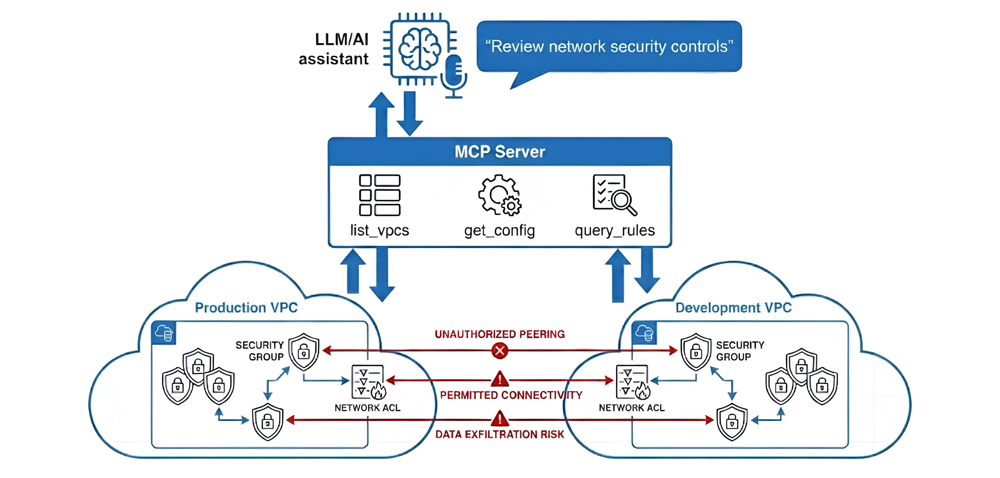

# Network Security Control Reviews with MCP and LLMs



## Overview

An educational lab exercise demonstrating how to use Model Context Protocol (MCP) servers with LLMs to perform automated Network Security Control (NSC) configuration reviews and network segmentation analysis. This lab uses AWS Security Groups and Network ACLs as examples of Network Security Controls, enabling security professionals to "talk to" NSC configurations using natural language queries. While this implementation focuses on AWS, the architecture is extensible to support other NSC types including Azure Network Security Groups (NSGs), GCP Firewall Rules, OCI Security Lists, and traditional on-premises firewalls.

## Key Features

- **Read-only MCP Server** - Parse and query NSC configurations
- **Natural Language Queries** - Use LLMs to analyze NSC rules and segmentation through conversational queries
- **Network Segmentation Test Environment** - AWS test environment with production and development VPCs demonstrating NSC configurations
- **Segmentation Testing** - Test network segmentation between zones/VPCs using NSC rules

## Quick Start

1. **Set up AWS environment with Terraform** - Follow the [AWS Setup Guide](docs/aws-setup.md) to deploy test infrastructure (VPCs, Security Groups, Network ACLs) using Infrastructure as Code
2. **Install and configure MCP server** - Follow the [MCP Setup Guide](docs/mcp-setup.md) to install dependencies and connect to your LLM
3. **Start querying** - Load NSC configurations from AWS and analyze them using natural language queries such as those in [LLM Usage Examples](docs/llm-examples.md).

## Project Structure

```
.
├── mcp-server/          # MCP server implementation
│   ├── src/
│   │   ├── parsers/    # NSC parsers
│   │   └── tools/       # MCP tool definitions
│   └── tests/          # Unit tests (mocked) and integration tests (real AWS)
├── terraform/          # Terraform Infrastructure as Code (IaC) for AWS test environment
│   └── main.tf         # Defines VPCs, Security Groups, Network ACLs, and rules
└── docs/               # Documentation
```

## MCP Server Tools

The MCP server provides tools for querying NSC configurations. This implementation uses AWS Security Groups and Network ACLs as examples:

- `list_vpcs` - List all VPCs in AWS account with filtering by tags
- `get_config` - Load NSC configurations (AWS Security Groups and Network ACLs) directly from AWS
- `query_rules` - Query NSC rules by various criteria (source, destination, port, protocol, tags), or get all rules with no parameters

## Example Use Cases

- **NSC Configuration Review** - Review Network Security Control rules to identify overly permissive configurations, security gaps, and compliance issues
- **Segmentation Testing** - Verify network isolation between production and development networks using NSC rules and detect NSC rules that violate network segmentation policies

See [LLM Usage Examples](docs/llm-examples.md) for detailed examples using AWS Security Groups and Network ACLs.

## Documentation

- [AWS Setup Guide](docs/aws-setup.md) - Set up AWS test environment with Security Groups and Network ACLs (NSC examples)
- [MCP Setup Guide](docs/mcp-setup.md) - MCP server installation, configuration, and secure credential management
- [LLM Usage Examples](docs/llm-examples.md) - Detailed examples of NSC reviews and segmentation testing using AWS Security Groups and Network ACLs
- [Troubleshooting](docs/troubleshooting.md) - Common issues and solutions

## Network Security Controls (NSCs)

This lab demonstrates NSC reviews using AWS Security Groups and Network ACLs as practical examples. NSCs are rules and policies that govern network traffic flow, including, but not limited to:

- **AWS Security Groups**: Stateful, instance-level firewalls (the example used for this lab)
- **AWS Network ACLs**: Stateless, subnet-level firewalls (the example used for this lab)
- **Azure Network Security Groups (NSGs)**: Azure's NSC implementation
- **Google Cloud Platform (GCP) Firewall Rules**: GCP's NSC implementation
- **Oracle Cloud Infrastructure (OCI) Security Lists**: OCI's NSC implementation
- **Traditional On-Premises Firewalls**: Palo Alto, Check Point, Fortinet, Cisco

### Extensibility

This MCP server architecture is designed to be extensible. While the current implementation uses AWS Security Groups and Network ACLs as examples, you can extend it to support other NSC types:

1. **Create a parser**: Implement a parser class following the pattern in `mcp-server/src/parsers/aws_security_groups.py` or `aws_network_acls.py`
2. **Add MCP tools**: Extend `mcp-server/src/tools/nsc_tools.py` to support the new NSC parser
3. **Update documentation**: Add examples and usage instructions for the new NSC type

See `mcp-server/src/parsers/README.md` for extensibility documentation and examples.

## Learning Objectives

After completing this lab, you should be able to:

- **Infrastructure as Code (Terraform)**: Deploy and manage AWS infrastructure using Terraform, including VPCs, Security Groups, Network ACLs, and their rules
- **MCP Server Development**: Understand how MCP servers enable LLM interaction with structured data
- **NSC Analysis**: Use natural language and LLMs to query NSC configurations
- **Security Review**: Identify security and segmentation issues in NSC rules
- **NSC Architecture**: Understand how different AWS NSC types (Security Groups vs Network ACLs) operate at different layers (instance-level vs subnet-level)

## License

MIT License - See LICENSE file for details